# Project 1
## Images of the Russian Empire
Approach:
First I started with padding the image and attempting a 2d conv of kernel b over image a.
This worked well when you set the padding to 0.5

I realized you should crop the photo a bit for better match.

Next I changed to roll and started comparing only the center of image so I didn't have to worry about padding values at the edges.

Finally I implemented scaled align where it would align at multiple scales. I just rolled the base image by the scale from before and then rematched the photo.

I had some issues with emir photo but the simplest solution was to compare the r and g and g and b channels rather than r and b and g and b channels like the skeleton code gave. Intuition are that the wavelengths are more similar so the images would be slightly more similar. It did solve the problem.

## Images
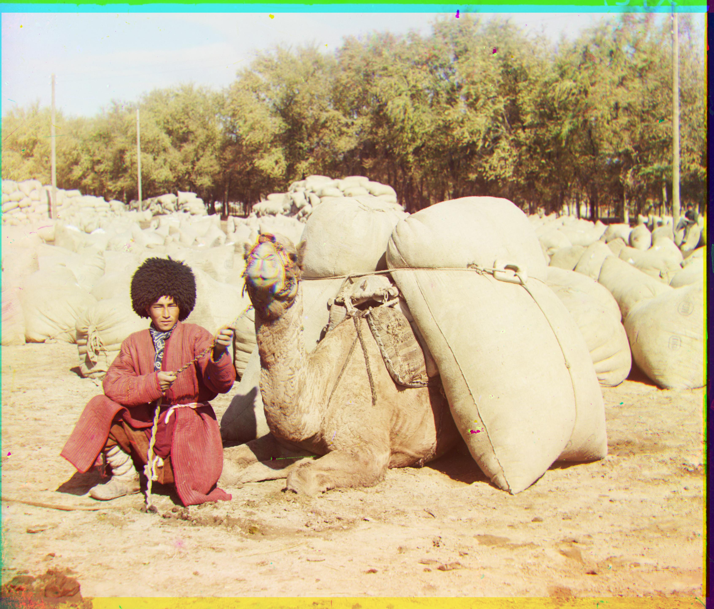
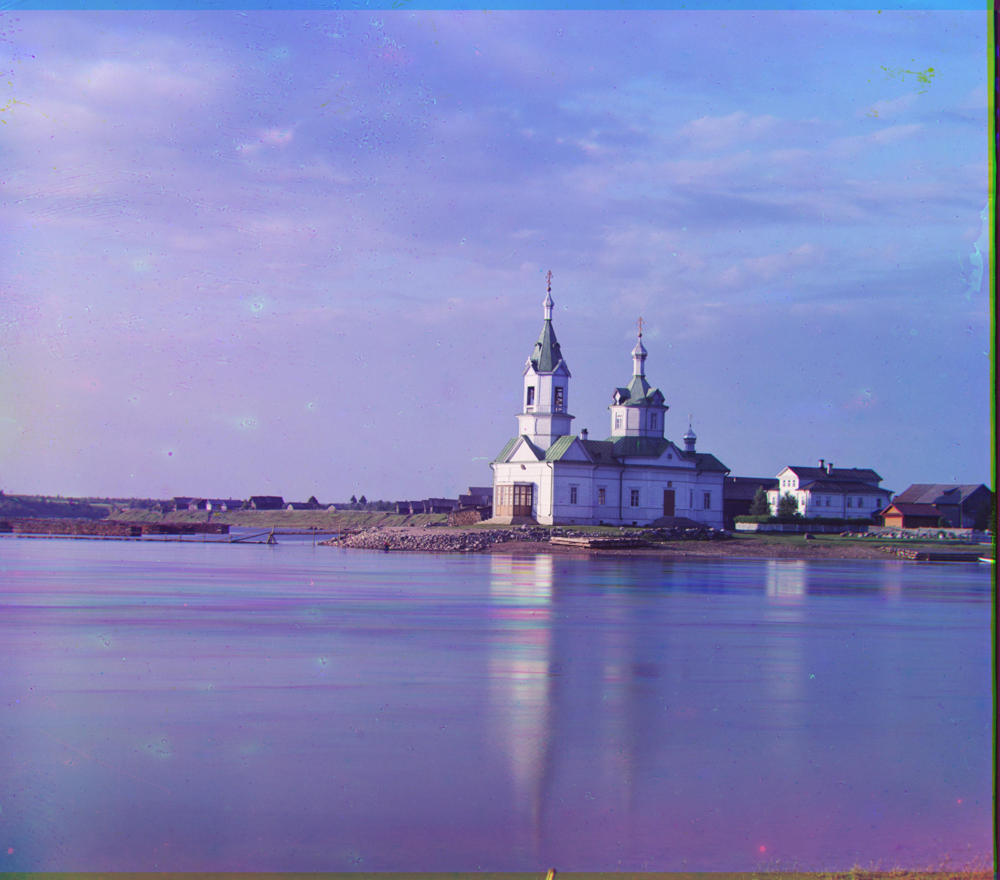
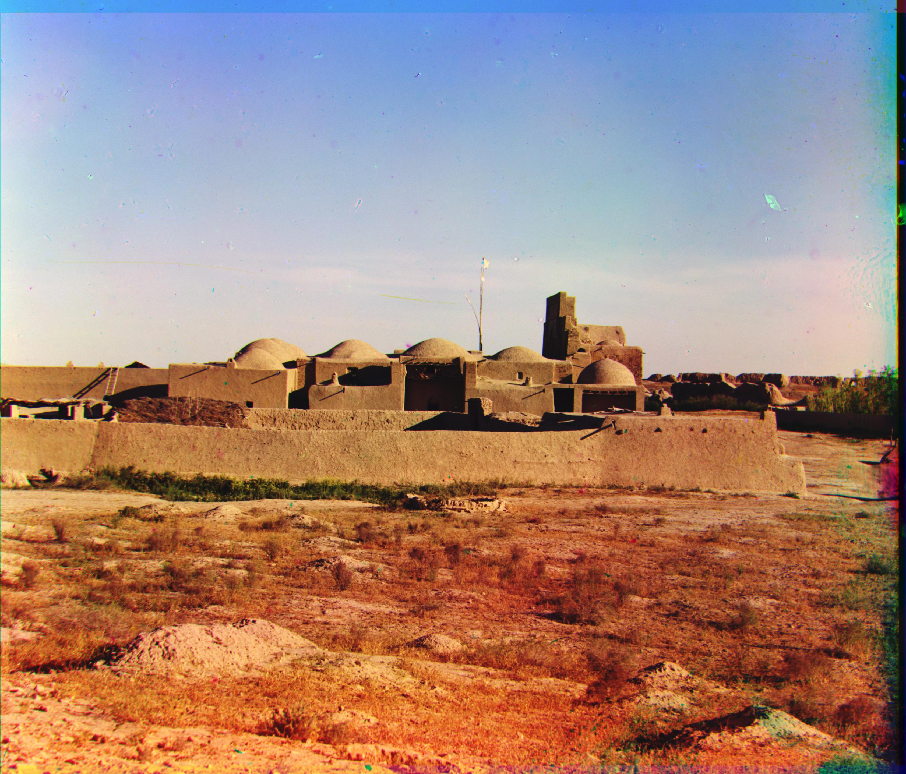
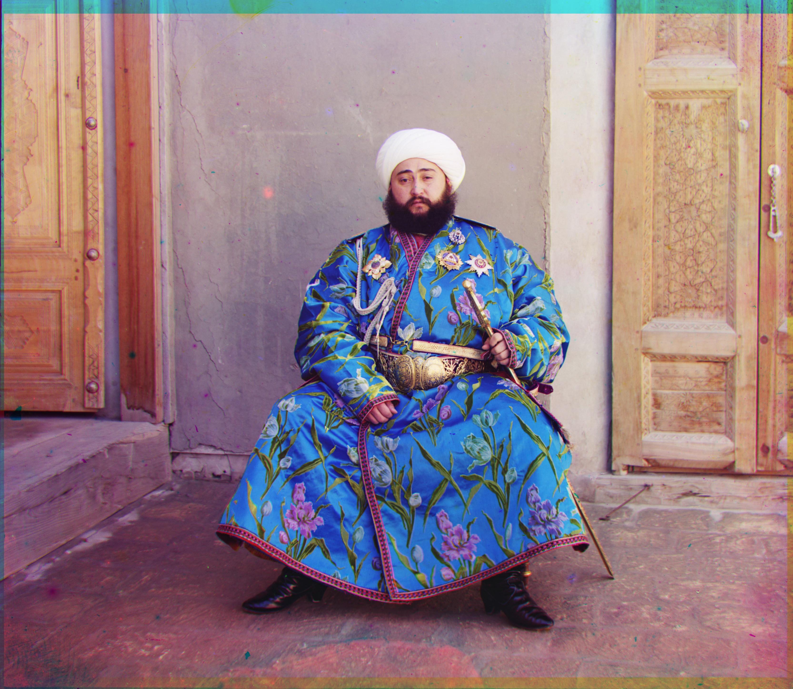
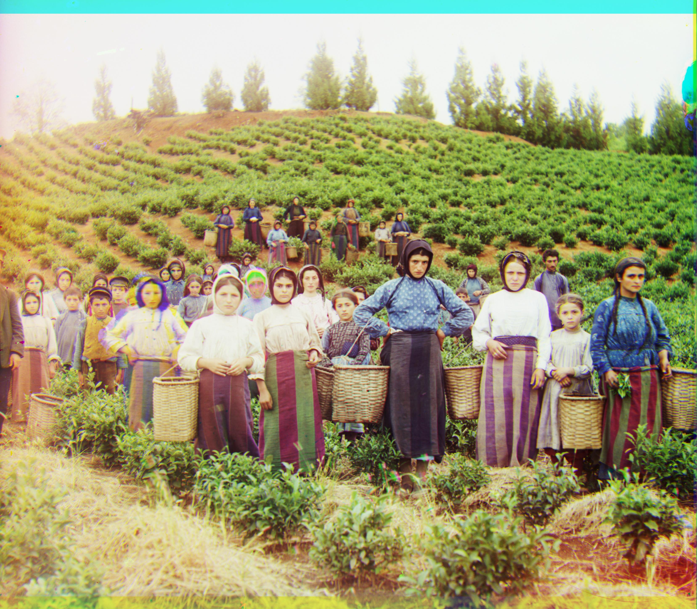
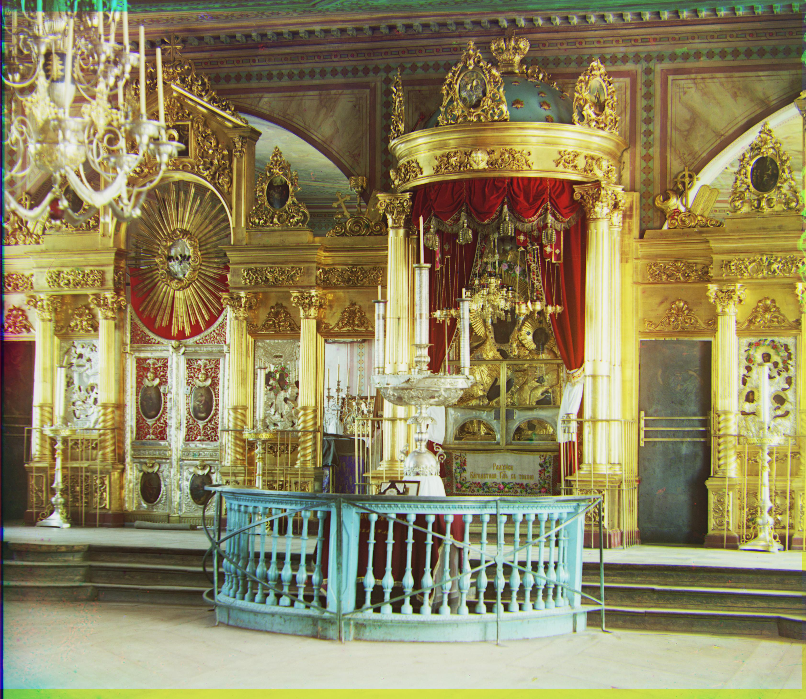
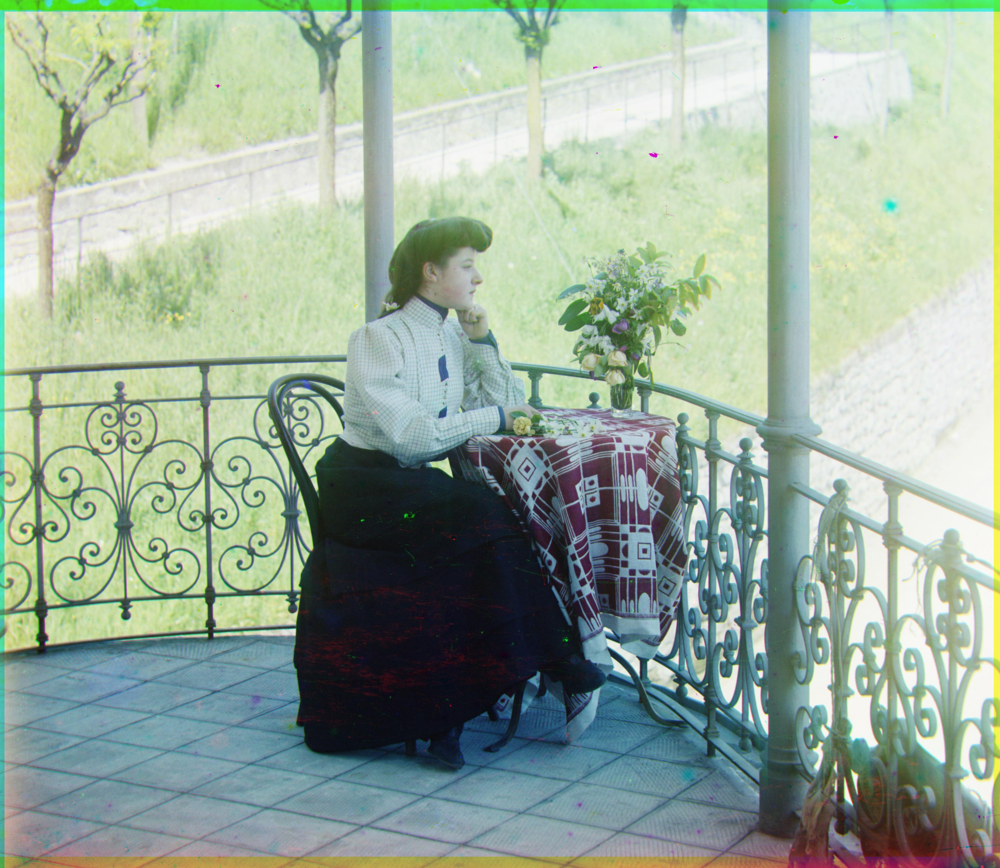
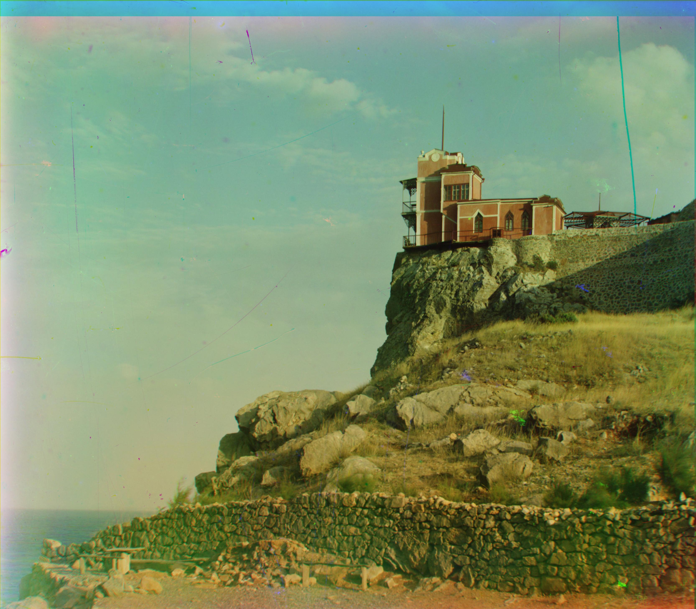

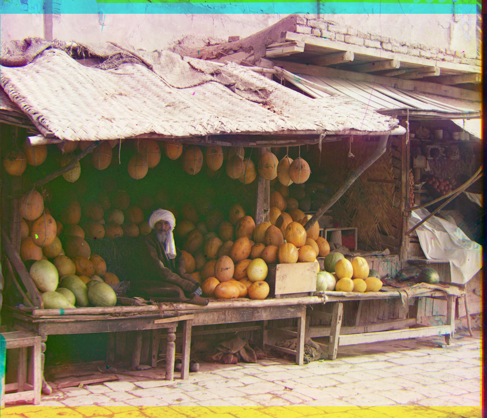
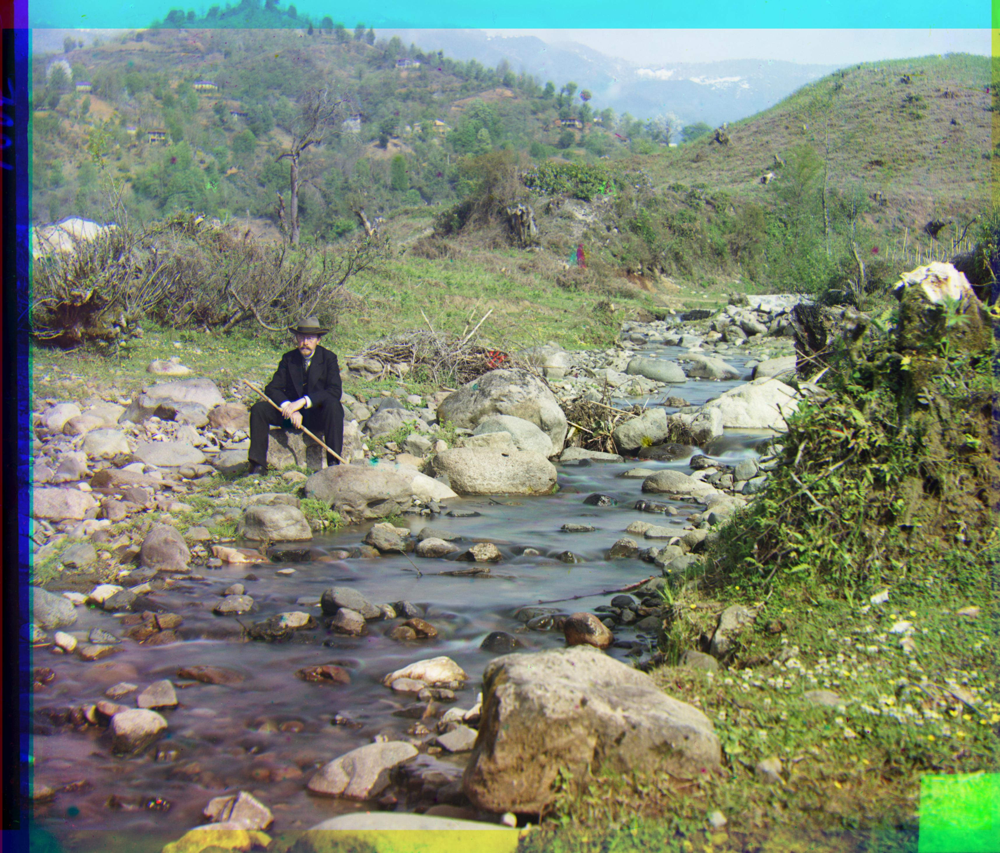
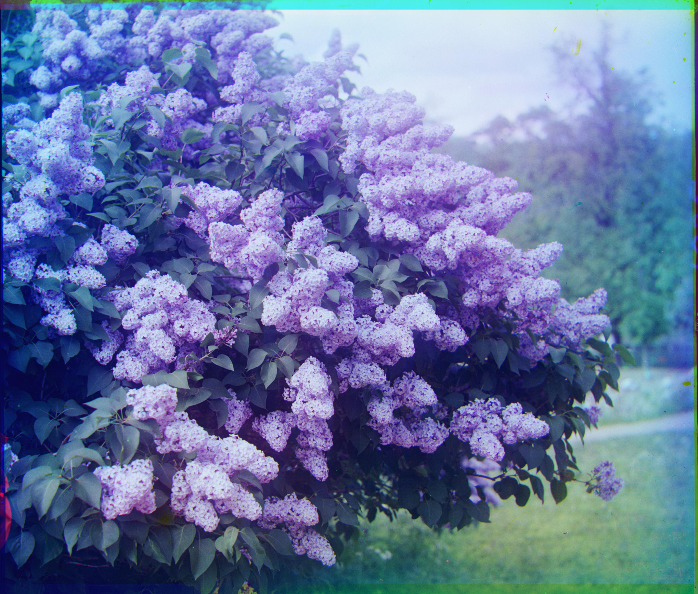
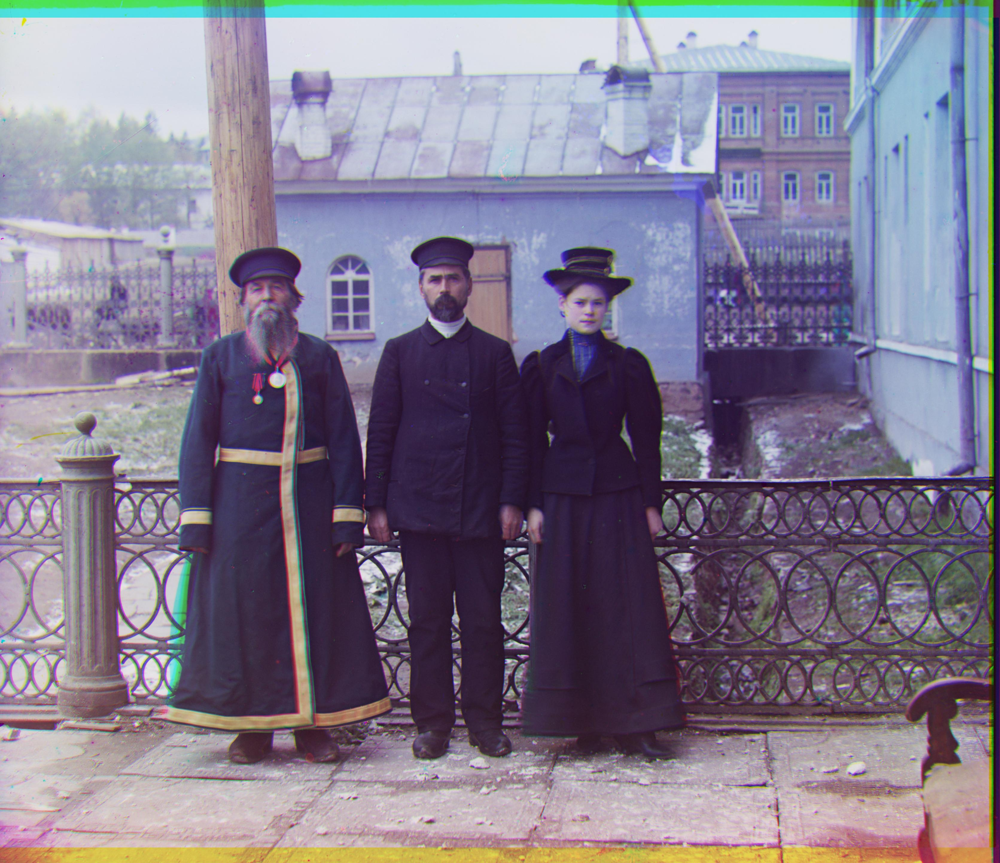

## Calculated Offsets
Image camel.jpg: {"red_shift": {"y_shift": 0, "x_shift": -1}, "green_shift": {"y_shift": 0, "x_shift": 0}, "blue_shift": {"y_shift": 0, "x_shift": -1}}
Image church.jpg: {"red_shift": {"y_shift": -1, "x_shift": 0}, "green_shift": {"y_shift": 0, "x_shift": 0}, "blue_shift": {"y_shift": -1, "x_shift": 0}}
Image city.jpg: {"red_shift": {"y_shift": -1, "x_shift": 0}, "green_shift": {"y_shift": 0, "x_shift": 0}, "blue_shift": {"y_shift": 0, "x_shift": 1}}
Image emir.jpg: {"red_shift": {"y_shift": 1, "x_shift": -1}, "green_shift": {"y_shift": 0, "x_shift": 0}, "blue_shift": {"y_shift": -1, "x_shift": 0}}
Image harvesters.jpg: {"red_shift": {"y_shift": 1, "x_shift": -1}, "green_shift": {"y_shift": 0, "x_shift": 0}, "blue_shift": {"y_shift": 0, "x_shift": -1}}
Image icon.jpg: {"red_shift": {"y_shift": 0, "x_shift": -1}, "green_shift": {"y_shift": 0, "x_shift": 0}, "blue_shift": {"y_shift": -1, "x_shift": -1}}
Image italil.jpg: {"red_shift": {"y_shift": 1, "x_shift": 1}, "green_shift": {"y_shift": 0, "x_shift": 0}, "blue_shift": {"y_shift": 0, "x_shift": 1}}
Image lastochikino.jpg: {"red_shift": {"y_shift": 0, "x_shift": -1}, "green_shift": {"y_shift": 0, "x_shift": 0}, "blue_shift": {"y_shift": 1, "x_shift": 0}}
Image lugano.jpg: {"red_shift": {"y_shift": 0, "x_shift": -1}, "green_shift": {"y_shift": 0, "x_shift": 0}, "blue_shift": {"y_shift": -1, "x_shift": 0}}
Image melons.jpg: {"red_shift": {"y_shift": 0, "x_shift": -1}, "green_shift": {"y_shift": 0, "x_shift": 0}, "blue_shift": {"y_shift": 0, "x_shift": -1}}
Image self_portrait.jpg: {"red_shift": {"y_shift": 0, "x_shift": 0}, "green_shift": {"y_shift": 0, "x_shift": 0}, "blue_shift": {"y_shift": -1, "x_shift": -1}}
Image siren.jpg: {"red_shift": {"y_shift": 1, "x_shift": -1}, "green_shift": {"y_shift": 0, "x_shift": 0}, "blue_shift": {"y_shift": 1, "x_shift": 0}}
Image three_generations.jpg: {"red_shift": {"y_shift": 1, "x_shift": -1}, "green_shift": {"y_shift": 0, "x_shift": 0}, "blue_shift": {"y_shift": 0, "x_shift": 0}}