<!-- MathJax -->
<script type="text/x-mathjax-config">
  MathJax.Hub.Config({
    tex2jax: {
      skipTags: ['script', 'noscript', 'style', 'textarea', 'pre'],
      inlineMath: [['\\(','\\)'], ['$', '$']]
    }
  });
</script>
<script src="https://cdn.mathjax.org/mathjax/latest/MathJax.js?config=TeX-AMS-MML_HTMLorMML" type="text/javascript"></script>

<style>
.image-container {
  display: flex; 
  align-items: center; 
  gap: 20px; 
}

.image-container img {
  max-width: 50%;
  height: auto;
}
</style>

# Project Part A: Warp and Mosaic
## Shooting photos and correspondences
Here are two sets of photos with their corresponding points marked. 
I used https://cal-cs180.github.io/fa23/hw/proj3/tool.html to mark the points for the transform.

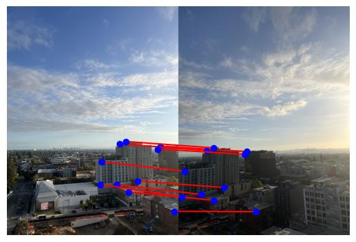
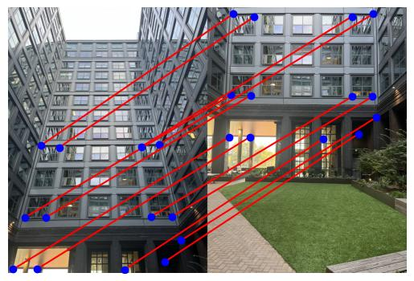

### Homography Equations

The relationship between the source point $(x, y)$ and the transformed point $(u, v)$ using a $3 \times 3$ homography matrix $\mathbf{H}$ in homogeneous coordinates is:

$$\begin{bmatrix} \lambda u \\ \lambda v \\ \lambda \end{bmatrix} = \mathbf{H} \begin{bmatrix} x \\ y \\ 1 \end{bmatrix} = \begin{bmatrix} h_1 & h_2 & h_3 \\ h_4 & h_5 & h_6 \\ h_7 & h_8 & 1 \end{bmatrix} \begin{bmatrix} x \\ y \\ 1 \end{bmatrix}$$

The non-homogeneous (projected) coordinates $(u, v)$ are derived as:

$$u = \frac{h_1x + h_2y + h_3}{h_7x + h_8y + 1}$$

$$v = \frac{h_4x + h_5y + h_6}{h_7x + h_8y + 1}$$

---

### Direct Linear Transformation (DLT) for Homography

To solve for the 8 unknown parameters in $\mathbf{h} = [h_1, h_2, \dots, h_8]^T$, the equations are cross-multiplied and rearranged into a linear system of the form $\mathbf{A}\mathbf{h} = \mathbf{b}$.

From $u(h_7x + h_8y + 1) = h_1x + h_2y + h_3$:
$$\quad xh_1 + yh_2 + h_3 - xuh_7 - yuh_8 = u$$

From $v(h_7x + h_8y + 1) = h_4x + h_5y + h_6$:
$$\quad xh_4 + yh_5 + h_6 - xvh_7 - yvh_8 = v$$

These equations, when solved for the parameters $[h_1, h_2, \dots, h_8]^T$, are typically represented by a pair of rows in the $\mathbf{A}$ matrix for a single correspondence point $(x, y) \to (u, v)$:

$$
\begin{bmatrix}
x & y & 1 & 0 & 0 & 0 & -ux & -uy \\
0 & 0 & 0 & x & y & 1 & -vx & -vy
\end{bmatrix}
\begin{bmatrix} h_1 \\ h_2 \\ h_3 \\ h_4 \\ h_5 \\ h_6 \\ h_7 \\ h_8 \end{bmatrix} = \begin{bmatrix} u \\ v \end{bmatrix}
$$


The handwritten matrix $\mathbf{A}$ for a single point $(x, y) \to (u, v)$ is:

$$
\begin{bmatrix}
x & y & 1 & 0 & 0 & 0 & -ux & -uy \\
0 & 0 & 0 & x & y & 1 & -vx & -vy
\end{bmatrix}
$$

Since this system system of equations requires at least **4 unique** points to solve, we compute this A matrix slice multiple times and stack each of them for the full least squares solution.

For **more than one point**, these $2 \times 8$ blocks are **stacked vertically** to form a large $\mathbf{A}$ matrix, $\mathbf{A}_{2N \times 8}$, where $N$ is the number of points (with $N \ge 4$ required for a unique solution).

Now taking take the panorama points from above we can compute the homography matrix. We construct the A matrix and b vector as shown below, which is passed to numpy least squares solver `np.linalg.lstsq` to compute the homography parameters.
```
A shape: (20, 8)
A:
[[     2558      1205         1         0         0         0  -6308028  -2971530]
 [        0         0         0      2558      1205         1  -6916832  -3258320]
 [     2541       497         1         0         0         0  -6156843  -1204231]
 [        0         0         0      2541       497         1  -5033721   -984557]
 [     2494       625         1         0         0         0  -5938214  -1488125]
 [        0         0         0      2494       625         1  -5234906  -1311875]
 [     3314       404         1         0         0         0 -10412588  -1269368]
 [        0         0         0      3314       404         1  -6415904   -782144]
 [     3417       622         1         0         0         0 -11173590  -2033940]
 [        0         0         0      3417       622         1  -7319214  -1332324]
 [     3618      1369         1         0         0         0 -13064598  -4943459]
 [        0         0         0      3618      1369         1 -10655010  -4031705]
 [     3193       808         1         0         0         0  -9831247  -2487832]
 [        0         0         0      3193       808         1  -7375830  -1866480]
 [     2905       114         1         0         0         0  -7953890   -312132]
 [        0         0         0      2905       114         1  -4851350   -190380]
 [     3359        61         1         0         0         0 -10543901   -191479]
 [        0         0         0      3359        61         1  -5535632   -100528]
 [     2607      1166         1         0         0         0  -6553998  -2931324]
 [        0         0         0      2607      1166         1  -6939834  -3103892]]
b shape: (20,)
b: [2466 2704 2423 1981 2381 2099 3142 1936 3270 2142 3611 2945 3079 2310 2738 1670 3139 1648 2514 2662]
H:
[[ 9.29478619e-01 -3.03579212e-01  1.00371264e+02]
 [ 6.50078862e-02  6.00099089e-01  1.42732033e+03]
 [ 8.70245131e-06 -1.37168036e-04  1.00000000e+00]]
```

## Warping and Rectification
### Image Warping Methods
For this part I implemented two image warping methods: nearest neighbor and bilinear interpolation. Because the base images I have are very high resolution, it is hard to see the difference that bilinear interpolation makes. So I created a synthetic checkerboard image to better illustrate the difference.

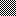
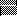
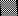

### Rectification Examples
Here are the results of rectifying the notebook image using both nearest neighbor and bilinear interpolation. The left rectified image is done with nearest neighbor, and the right one is done with bilinear interpolation. If you look closely, there is a chance you can see that bilinear interpolation produces smoother lines on the notebook.


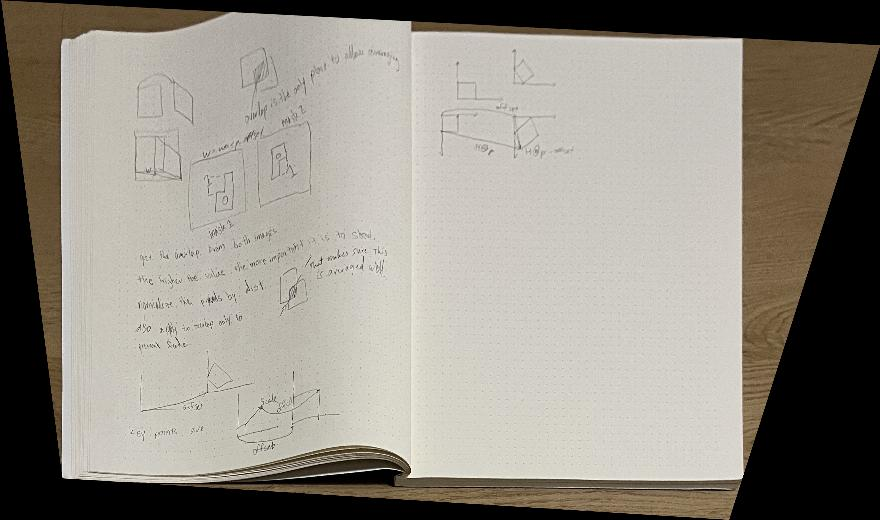

Next I made a square whiteboard.

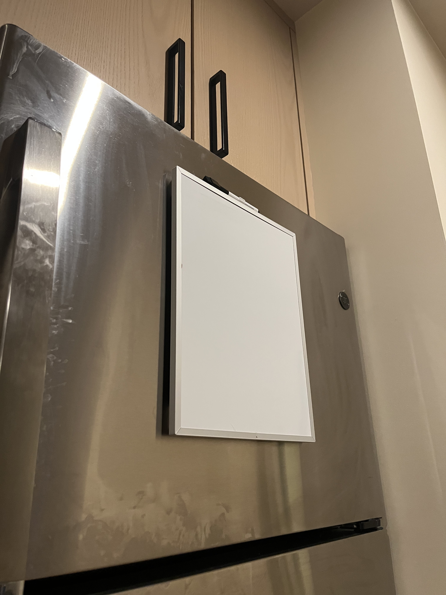

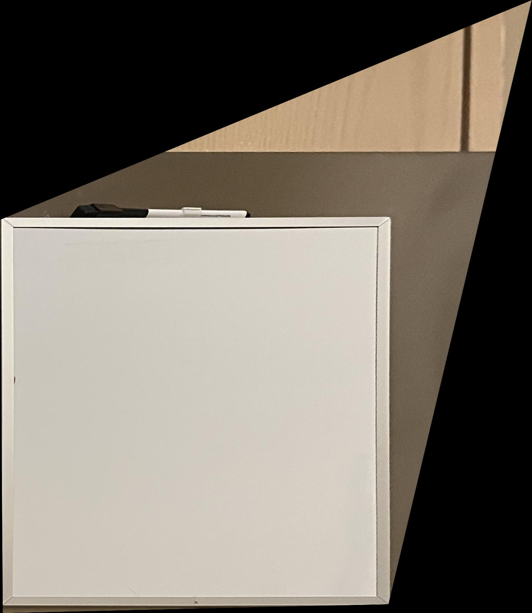

Finally, here are the results of rectifying the keyboard on my desk.

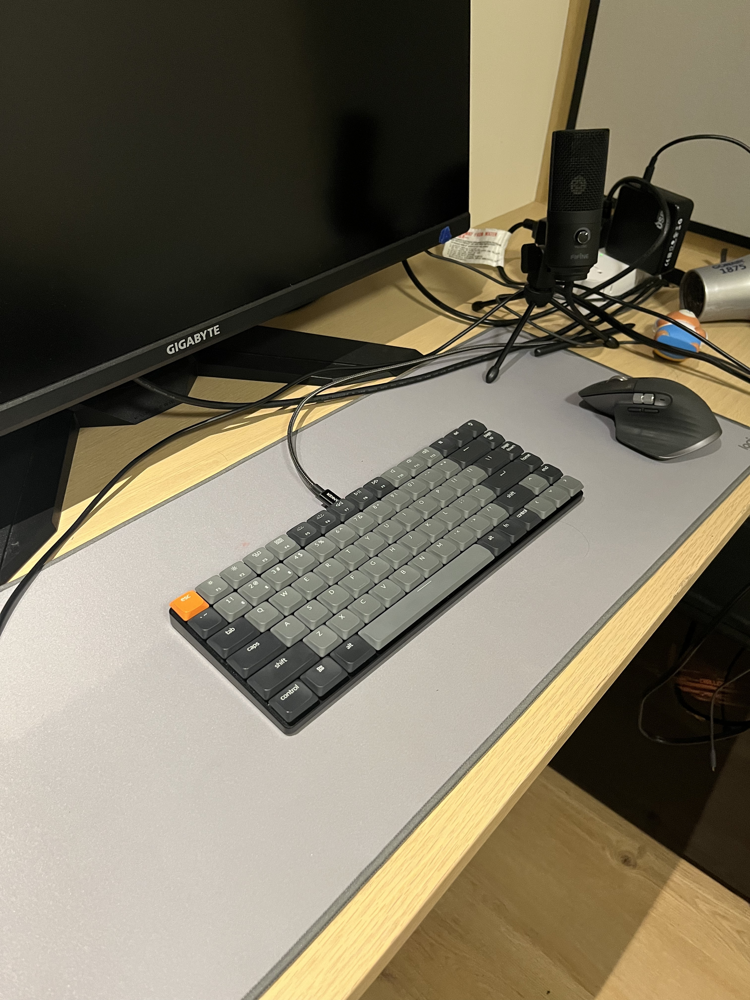

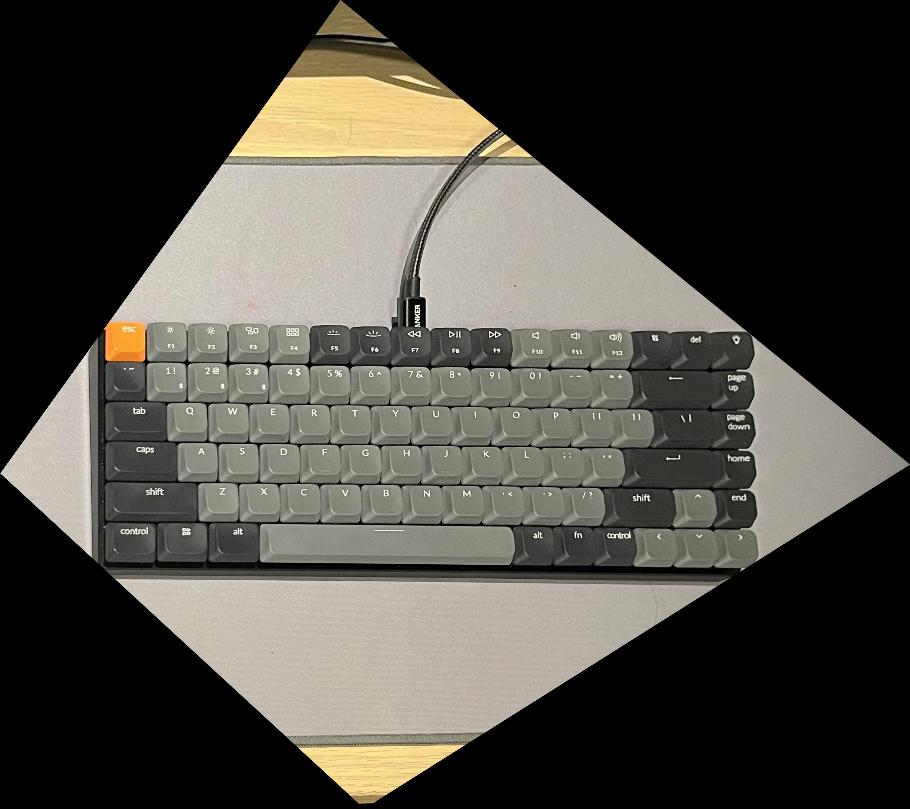

## Image Mosaicing
### Merge Method
I've implemented warping such that it returns the offsets from (0, 0) to the new (0, 0) location of the image bounding box along with the binary pixel mask of the object in the canvas. This allows me to paste in the image at the correct location relative to the original image. 

Once I've warped it I can also find out the the full size of the canvas needed to fit both images. I do this by taking the minimum and maximum x, y coordinates of the 4 corners of both images. Using this information, I create a zeroed canvas of that size and paste in the two images at their respective offsets. The base image naturally is offset based on the minimum x, y coordinates of the two images since they may be negative.

This is the full code used to paste these images.
``` python 
canvas[offset1[0]:offset1[0] + h1, offset1[1]:offset1[1] + w1] = im1
canvas[offset2[0]:offset2[0] + h2, offset2[1]:offset2[1] + w2][mask[:, :]] = im2_w[mask[:, :]]
```
Notice that I am indexing through the mask to prevent the projected image's black background from being pasted over relevant parts of the base image.

When merging to reduce the artifacts, I multiply the image by the mask (hadamard product) and add it to the initially zeroed canvas. This way, the non-overlapping regions are essentially copied over, and the overlapping regions are summed together. Further below, I explain how I compute these weighted average masks to prevent edge artifacts. This weighted averaging is sufficient to produce a good looking mosaic with heavily reduced edge artifacts.

Here are 2 mosaics I was able to make from Anchor House.

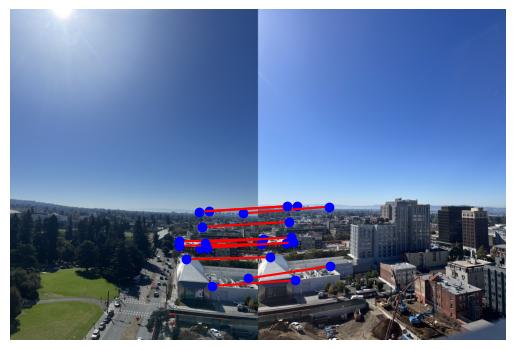


---


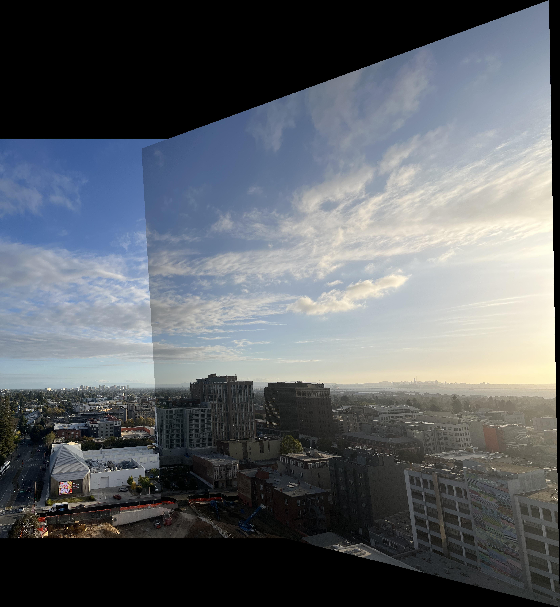
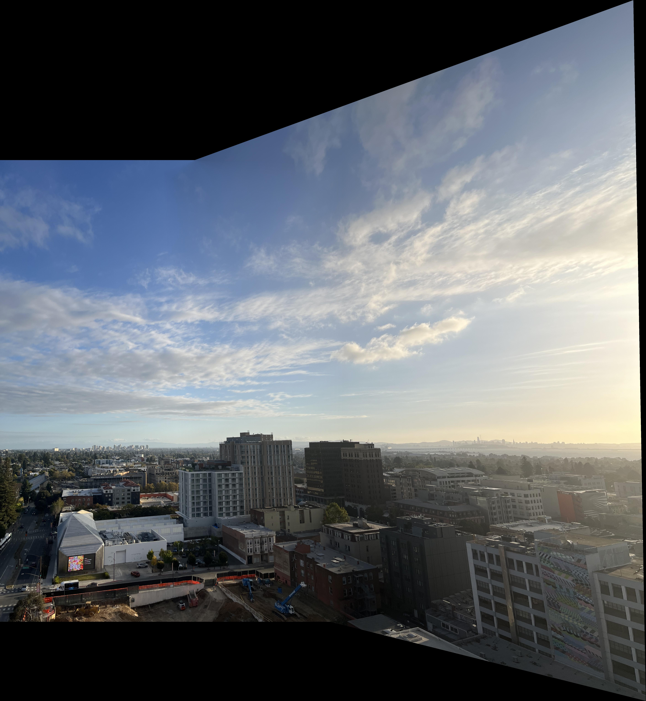

---


### Preventing Edge Artifacts
In order to prevent edge artifacts when blending the two images, I used weighted averaging within the overlapping region. I take the image and the background combined, the generate the bwdist transform of the mask. On parts of the image that don't overlap the weight is 1, and on parts that do overlap I compute the weight by dividing by the sum of the two distance transforms. This way as we get closer the edges of the overlapping region, the weight goes more heavily towards the original image from which it's closer to.

Here are masks for the image in anchor as an example:
We start with the base mask, which is the mask of the top image and the background image combined.

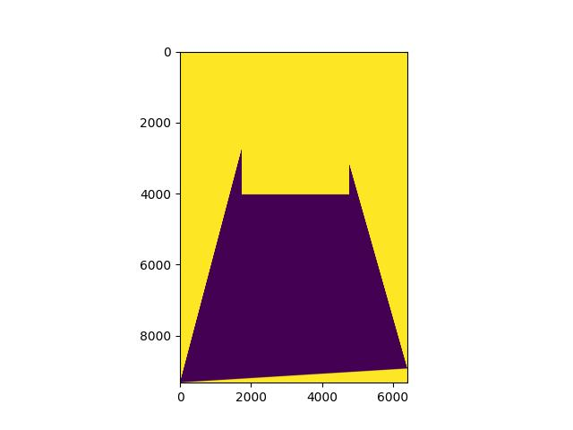

Next we compute the distance transform of the base mask.

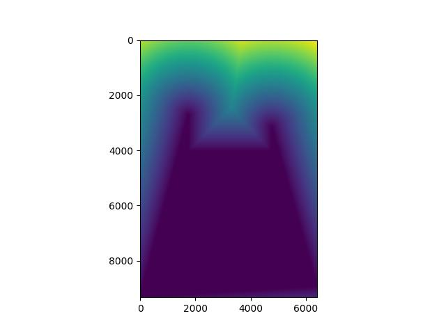

Next we compute the intersection mask of the two images.

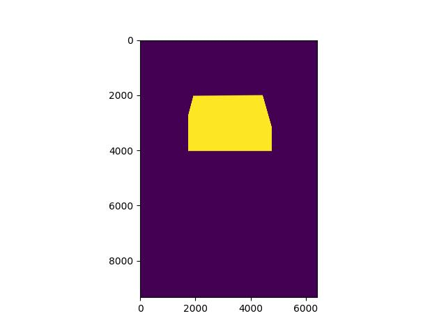

Finally we compute the full mask, which is the base mask with the bw_dist based mask applied to the overlapping region.
The overlapping region has the weight computed by the distance transform.

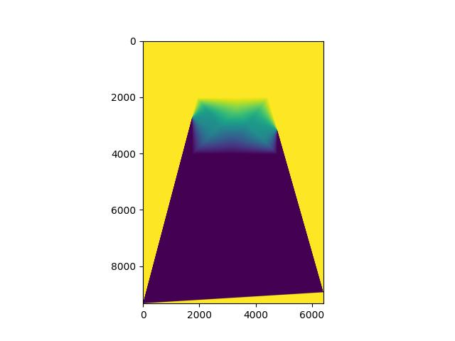

This update function gets pretty messy since the masks are computed on the full canvas, but the images are only on their respective bounding boxes. So I have to index into the correct parts of the masks to get the right values.
``` python
canvas[offset1[0]:offset1[0] + h1, offset1[1]:offset1[1] + w1] = im1 * canvas_mask1[offset1[0]:offset1[0] + h1, offset1[1]:offset1[1] + w1][:, :, None]
canvas[offset2[0]:offset2[0] + h2, offset2[1]:offset2[1] + w2] += im2_w * canvas_mask2[offset2[0]:offset2[0] + h2, offset2[1]:offset2[1] + w2][:, :, None]
```

---
# Project Part B: Autostitching
## Harris Corner Detection
I apply the harris corner detector. When doing so I increase the min distance from 1 to 10 since I have high resolution images and need to reduce the number of corners for anms. Next I apply ANMS to reduce the number of corners to 500. Here are the corners before and after ANMS.

Computing anms for a single point involves finding the corner value h along with the corner's position as a tuple. We then find all the points with 1.11 (1/0.9) times more than the corner value h. These are all candidates who's strength is significantly higher than the corner we're looking at. We then find the distance from the corner to all these candidates, and take the minimum distance. We compute this radius metric for all corners.

Following this we take the top 500 points with the highest radius metric. This allows us to both supress the amount of corners that we have in the image while not losing the spread of points in the image. Essentially points without significantly higher confidence points in the neighborhood are chosen as corners for potential matching. It is critical that we sample corners from all over the image to get enough points to compute a good homography.


<div class="image-container">
  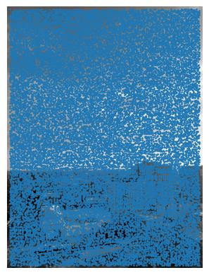
  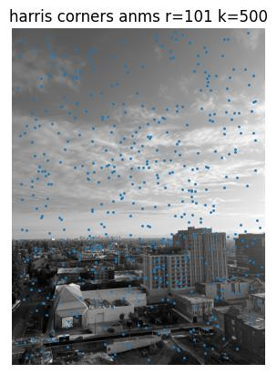
</div>

## Feature Descriptor Extraction
I extract 40x40 patches around each corner, and apply Gaussian blurring with sigma=2 to get the low frequency features. Finally I sample every 5th pixel to get an 8x8 feature for each corner. Here are some example patches, blurred patches, and 8x8 features.
<div class="image-container">
  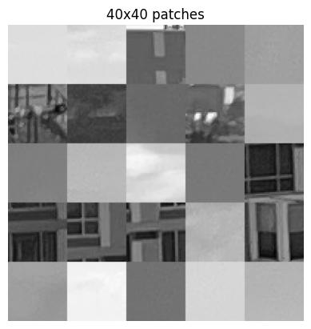
  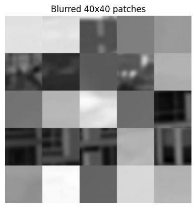
  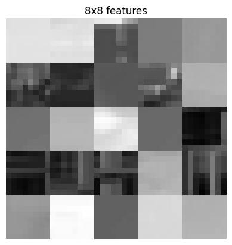
</div>

## Feature Matching
I apply feature matching by flattening the 8x8 raw patches into feature vectors that we use for nearest neighbor matching. Doing so gets us two sets of features for the two images that we want a mosaic of.
I train the NN model on one set of features. Following that I get the 1-NN and 2-NN for each of the features in the other image. To compute the error ratio, I find the distance between the feature and its 1-NN and 2-NN. The ratio of these two distances is the error ratio. If the error ratio is below 0.5 we accept the match, otherwise we reject it.

The idea here is that although features may not be pixel perfect, the 1-NN typically has much less error than the 2-NN, but the range between the errors at 1-NN may vary widely. This is why we use the ratio of the two distances.

At this phase we've mostly eliminated the bad matches, but you can still see a couple on non-parallel lines.

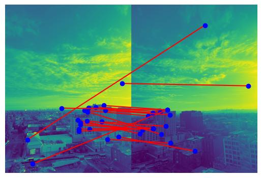

## RANSAC for Robust Homography
Applying RANSAC really helps us to eleiminate all remaining outliers when we attempt to compute our homography matrix. We sample 4 random points and comptue the homography matrix. Useing this homography matrix we compute the error over all matched corner points. If the L2 error is under 10 we keep that match as an inlier. We repeat this 900 times and keep the iteration with the most inliers. Finally we recompute the homography matrix using all inliers from the best iteration. This seems to work really well for most images. It seems that some images with repeating features similar to the apartment building image that I used before are difficult to stitch correctly due to too many feature matching errors.

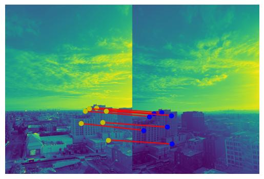

On the left is the manual correspondence mosaic, and on the right is the autostitched mosaic.

<div class="image-container">
  
  
</div>

On the left is the manual correspondence mosaic, and on the right is the autostitched mosaic.

<div class="image-container">
  
  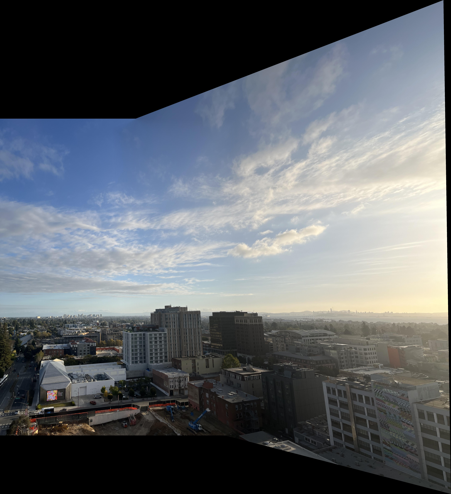
</div>

Finally here is a mosaic of the campinelle.
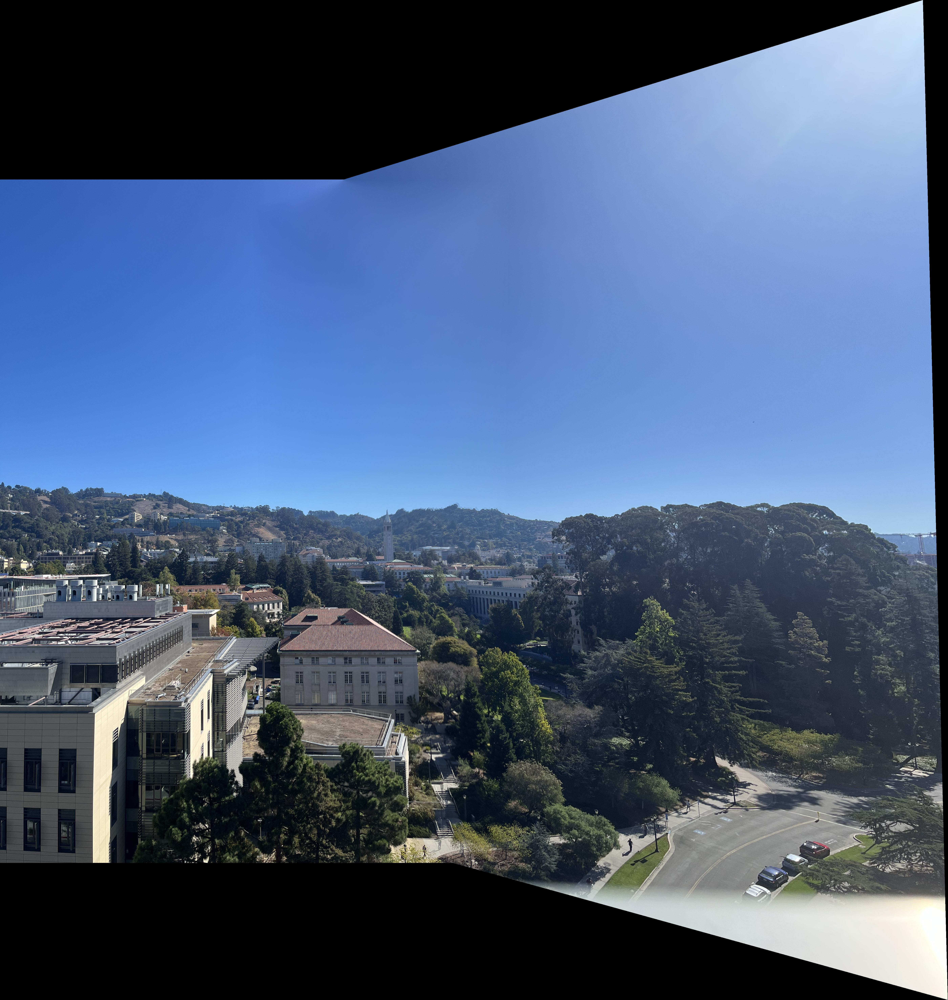
